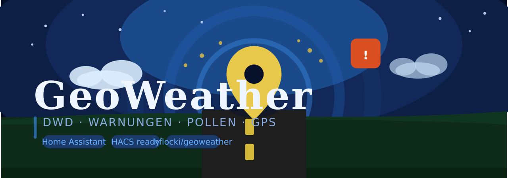

<div align="center">
  
  <h1>GeoWeather</h1>

  <p>
    
    
    <a href="https://www.home-assistant.io"></a>
    <a href="https://discord.gg/5JUWSw79Rq"></a>
  </p>
</div>

A Home Assistant custom integration that uses your vehicle's GPS coordinates to fetch
live data from the **German Weather Service (DWD)**:

- 📍 Current location (Gemeinde / Kreis / Bundesland / WarnCellID)
- ⛈️ Active weather warnings (with severity, type, time range)
- 🌿 Pollen forecast (today / tomorrow / day-after, 9 pollen types)
- 🚗 Moving detection via GPS speed sensor (skips API calls while driving)

> **Philosophy:** No polling timer. You control when data is fetched by calling
> the `geoweather.update` service from your own Automations.

---

## Installation via HACS

1. Open HACS → **Integrations** → ⋮ → *Custom repositories*
2. Add `https://github.com/hflocki/geoweather` as type **Integration**
3. Install **GeoWeather**
4. Restart Home Assistant
5. Go to **Settings → Integrations → Add Integration → GeoWeather**

## Manual Installation

Copy the `custom_components/geoweather/` folder into your
`config/custom_components/` directory, then restart Home Assistant.

---

## Configuration

During setup you select your GPS sensors:

| Field | Required | Description |
|---|---|---|
| Latitude sensor | ✅ | e.g. `sensor.my_gps_latitude` |
| Longitude sensor | ✅ | e.g. `sensor.my_gps_longitude` |
| Speed sensor | ✅ | km/h – used for moving detection |
| Altitude sensor | ➖ | Optional – shown in attributes |
| Satellites sensor | ➖ | Optional – enables GPS fix quality check |
| Speed threshold | ➖ | Default: 5.0 km/h – above = moving |
| Min. satellites | ➖ | Default: 4 – below = bad fix, skip update |

Works with **any** GPS source: ESPHome, GPSd, MQTT tracker, phone, etc.

Wichtig: Kopieren Sie die Datei pollen_mapping.yaml.example in Ihren Home Assistant /config/ Ordner und benennen Sie diese in pollen_mapping.yaml um, damit Ihre Anpassungen bei Updates nicht verloren gehen.
---

## Entities

| Entity | Description |
|---|---|
| `sensor.geoweather_standort` | Current Gemeinde (state) + Kreis, Bundesland, WarnCellID |
| `sensor.geoweather_dwd_warnungen` | Active warnings count (state) + full warning list |
| `sensor.geoweather_pollenflug` | Highest pollen level today (state) + all 9 types × 3 days |
| `binary_sensor.geoweather_faehrt` | `on` = moving, `off` = stationary |

---

## Service: `geoweather.update`

Triggers a fresh fetch of all DWD data. Safe to call at any time –
automatically skipped when:
- Vehicle is moving (speed > threshold)
- GPS fix is insufficient (satellites < minimum)

### Example Automation

```yaml
- alias: "GeoWeather – periodisch aktualisieren"
  id: geoweather_periodic_update
  trigger:
    - platform: time_pattern
      minutes: "/60"
    - platform: state
      entity_id: binary_sensor.geoweather_faehrt
      from: "on"
      to: "off"
  condition:
    - condition: state
      entity_id: binary_sensor.geoweather_faehrt
      state: "off"
  action:
    - service: geoweather.update
      data: {}
```

```yaml
- alias: "GeoWeather – nach Positionswechsel"
  id: geoweather_position_change
  trigger:
    - platform: state
      entity_id: sensor.my_gps_latitude
  condition:
    # 1. Wir müssen stehen
    - condition: state
      entity_id: binary_sensor.geoweather_faehrt
      state: "off"
    # 2. Nur wenn sich der Wert wirklich geändert hat (nicht nur Zeitstempel)
    - condition: template
      value_template: "{{ trigger.from_state.state != trigger.to_state.state }}"
    # 3. Optional: Nur wenn die Änderung groß genug ist (ca. 1km = 0.01 Grad)
    - condition: template
      value_template: "{{ (trigger.from_state.state | float - trigger.to_state.state | float) | abs > 0.01 }}"
  action:
    - service: geoweather.update
      data: {}
```

### Example Card

```yaml
type: custom:button-card
entity: sensor.pollenflug
aspect_ratio: 1/1
show_name: true
name: Pollenflug
show_state: true
state_display: |
  [[[
    const s = entity.state;
    if (s == '0')   return 'Keine';
    if (s == '0-1') return 'Keine bis gering';
    if (s == '1')   return 'Gering';
    if (s == '1-2') return 'Gering bis mittel';
    if (s == '2')   return 'Mittel';
    if (s == '2-3') return 'Mittel bis hoch';
    if (s == '3')   return 'Stark';
    return s;
  ]]]
styles:
  card:
    - padding: 5px
    - background-color: |
        [[[
          const s = entity.state;
          if (!s || s === 'unknown' || s === '0') return 'var(--card-background-color)';
          
          // Nimm bei "1-2" die 2, bei "2-3" die 3 für die Farbe
          const val = s.includes('-') ? parseInt(s.split('-')[1]) : parseInt(s);

          if (val === 1) return '#ffeb3b'; // Gelb
          if (val === 2) return '#fb8c00'; // Orange
          if (val >= 3) return '#e53935'; // Rot
          return 'var(--card-background-color)';
        ]]]
  icon:
    - color: |
        [[[
          const s = entity.state;
          const val = s.includes('-') ? parseInt(s.split('-')[1]) : parseInt(s);
          if (val === 0 || isNaN(val)) return '#c5e566';
          return (val >= 2) ? 'white' : 'black';
        ]]]
  name:
    - font-weight: bold
    - font-size: 12px
    - color: |
        [[[
          const s = entity.state;
          const val = s.includes('-') ? parseInt(s.split('-')[1]) : parseInt(s);
          return (val >= 2) ? 'white' : 'var(--primary-text-color)';
        ]]]
  state:
    - font-size: 11px 
    - font-weight: bold
    - color: |
        [[[
          const s = entity.state;
          const val = s.includes('-') ? parseInt(s.split('-')[1]) : parseInt(s);
          return (val >= 2) ? 'white' : 'var(--primary-text-color)';
        ]]]
```

---

## Pollen Region Mapping

DWD uses their own region names that sometimes differ from official Kreisname.
If your region is not found, add a mapping to `const.py`:

```python
POLLEN_REGION_MAPPING = {
    "Dein Kreis": "DWD Regionsname",
}
```

---

## Credits

DWD data via [DWD OpenData](https://opendata.dwd.de).
