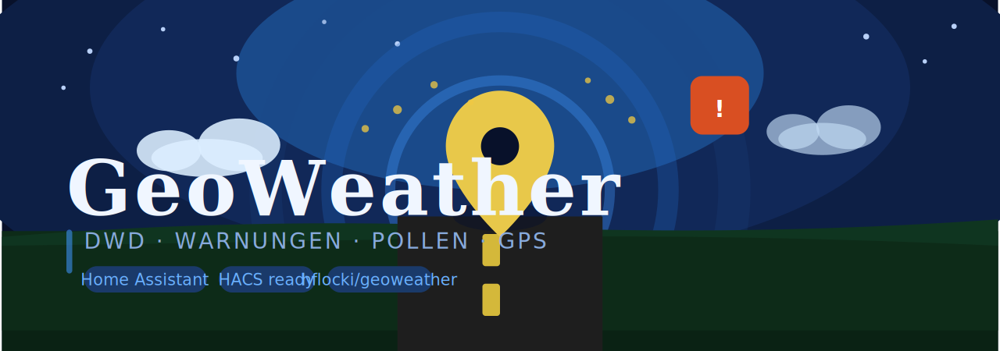

<p align="center">
  
</p>

# GeoWeather 🚐🌦️

[](https://hacs.xyz)
[](https://www.home-assistant.io)

A Home Assistant custom integration that uses your vehicle's GPS coordinates to fetch
live data from the **German Weather Service (DWD)**:

- 📍 Current location (Gemeinde / Kreis / Bundesland / WarnCellID)
- ⛈️ Active weather warnings (with severity, type, time range)
- 🌿 Pollen forecast (today / tomorrow / day-after, 9 pollen types)
- 🚗 Moving detection via GPS speed sensor (skips API calls while driving)

> **Philosophy:** No polling timer. You control when data is fetched by calling
> the `geoweather.update` service from your own Automations.

---

## Installation via HACS

1. Open HACS → **Integrations** → ⋮ → *Custom repositories*
2. Add `https://github.com/hflocki/geoweather` as type **Integration**
3. Install **GeoWeather**
4. Restart Home Assistant
5. Go to **Settings → Integrations → Add Integration → GeoWeather**

## Manual Installation

Copy the `custom_components/geoweather/` folder into your
`config/custom_components/` directory, then restart Home Assistant.

---

## Configuration

During setup you select your GPS sensors:

| Field | Required | Description |
|---|---|---|
| Latitude sensor | ✅ | e.g. `sensor.my_gps_latitude` |
| Longitude sensor | ✅ | e.g. `sensor.my_gps_longitude` |
| Speed sensor | ✅ | km/h – used for moving detection |
| Altitude sensor | ➖ | Optional – shown in attributes |
| Satellites sensor | ➖ | Optional – enables GPS fix quality check |
| Speed threshold | ➖ | Default: 5.0 km/h – above = moving |
| Min. satellites | ➖ | Default: 4 – below = bad fix, skip update |

Works with **any** GPS source: ESPHome, GPSd, MQTT tracker, phone, etc.

---

## Entities

| Entity | Description |
|---|---|
| `sensor.geoweather_standort` | Current Gemeinde (state) + Kreis, Bundesland, WarnCellID |
| `sensor.geoweather_dwd_warnungen` | Active warnings count (state) + full warning list |
| `sensor.geoweather_pollenflug` | Highest pollen level today (state) + all 9 types × 3 days |
| `binary_sensor.geoweather_faehrt` | `on` = moving, `off` = stationary |

---

## Service: `geoweather.update`

Triggers a fresh fetch of all DWD data. Safe to call at any time –
automatically skipped when:
- Vehicle is moving (speed > threshold)
- GPS fix is insufficient (satellites < minimum)

### Example Automation

```yaml
- alias: "GeoWeather – periodisch aktualisieren"
  id: geoweather_periodic_update
  trigger:
    - platform: time_pattern
      minutes: "/60"
    - platform: state
      entity_id: binary_sensor.geoweather_faehrt
      from: "on"
      to: "off"
  condition:
    - condition: state
      entity_id: binary_sensor.geoweather_faehrt
      state: "off"
  action:
    - service: geoweather.update
      data: {}
```

```yaml
- alias: "GeoWeather – nach Positionswechsel"
  id: geoweather_position_change
  trigger:
    - platform: state
      entity_id: sensor.my_gps_latitude
  condition:
    # 1. Wir müssen stehen
    - condition: state
      entity_id: binary_sensor.geoweather_faehrt
      state: "off"
    # 2. Nur wenn sich der Wert wirklich geändert hat (nicht nur Zeitstempel)
    - condition: template
      value_template: "{{ trigger.from_state.state != trigger.to_state.state }}"
    # 3. Optional: Nur wenn die Änderung groß genug ist (ca. 1km = 0.01 Grad)
    - condition: template
      value_template: "{{ (trigger.from_state.state | float - trigger.to_state.state | float) | abs > 0.01 }}"
  action:
    - service: geoweather.update
      data: {}
```

---

## Pollen Region Mapping

DWD uses their own region names that sometimes differ from official Kreisname.
If your region is not found, add a mapping to `const.py`:

```python
POLLEN_REGION_MAPPING = {
    "Dein Kreis": "DWD Regionsname",
}
```

---

## Credits

Inspired by [hass-geolocator](https://github.com/SmartyVan/hass-geolocator) by SmartyVan.
DWD data via [DWD OpenData](https://opendata.dwd.de).
